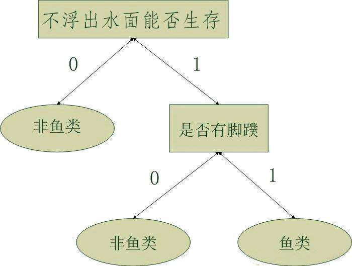

## 决策树

决策树（Decision Tree）是一种树形结构，可以看成由_结点_和_有向边_组成的有向树。决策树的每个非终端结点分别对应一个__特征__（或称__属性__），其每个分支代表这个特征所有可能的取值（属性值）；每个叶子结点表示一个类别。

## 构造决策树

我们使用Python语言中的字典（dict）来表示树形结构，无需额外构造数据结构

形如：`{'不浮出水面是否可以生存': {0: '非鱼类', 1: {'是否有脚蹼': {0: '非鱼类', 1: '鱼类'}}}}`

> 构造决策树的方法：_ID3算法_。   
> 工作原理：得到原始数据集，然后基于最好的属性值（选择信息增益最大的属性）划分数据集；第一次划分之后，数据将被向下传递到树分支的下一个节点，在这个节点上，我们可以再次划分数据；递归结束的条件是，程序遍历完所有划分数据集的属性，或者每个分支下的所有实例都具有相同的分类。如果所有实例具有相同的分类，则得到一个叶子结点或者终止块。

代码详见：[trees.py -> createTree()](trees.py)

## 决策树的存储

构造决策树是个很耗时的任务，为了节省计算时间，我们可以将分类器存储在硬盘上，而不用每次对数据分类时重新学习一遍。使用Python模块pickle序列化对象，序列化对象可以在磁盘上保存对象，并在需要的时候读取出来。

代码详见：[trees.py -> storeTree()](trees.py)

## 使用决策树进行分类

从根结点开始，测试待分类数据中相应的特征（每个非终端结点对应一个特征），按照其值选择相应的分支进入决策树的下一层，直到到达叶子结点，叶子结点对应的类别即为分类结果。

> 伪码：  
> 0. 输入参数: (决策树、特征表、测试数据)   
> 1. 首先找到根结点，以及根结点对应的特征在特征表中的索引；得到去除根结点后的森林   
> 2. 遍历根结点的每个分支，找到与测试数据相应特征取值相同的分支，进入相应的子树。如果子树根结点为叶子结点，则返回分类结果，算法终止；否则执行第3步   
> 3. 递归地进行进行分类，转到步骤0，第一个参数变为：对应的子树。

代码详见：[trees.py -> classify()](trees.py)

## 算法应用

使用决策树预测隐形眼镜类型

代码详见 [glasses.py](glasses.py)